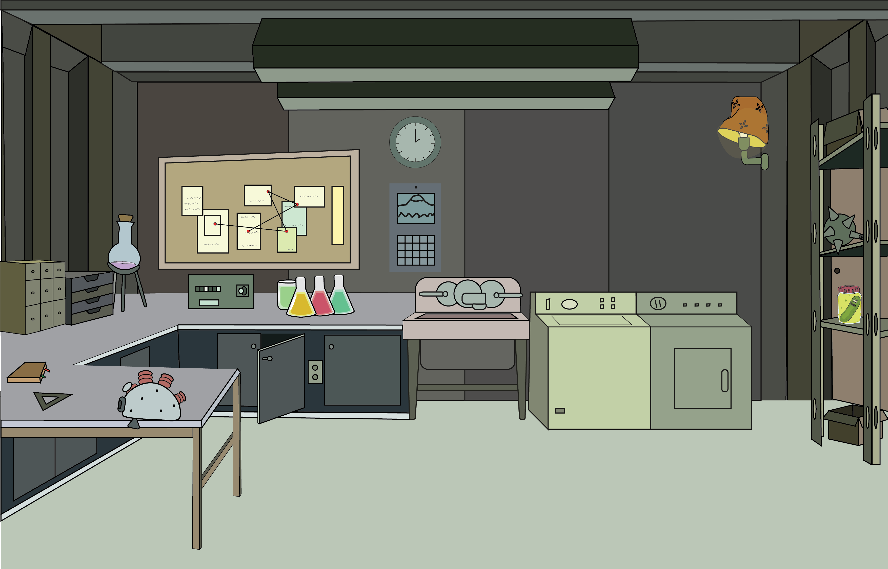

# 🧪 My First Illustrator Project - Rick's Lab

### Project Description
For my first Illustrator project, I was tasked with creating a room. I chose to design **Rick's Lab** from the animated series **Rick and Morty**.  
The project helped me practice essential Illustrator tools and techniques while exploring creative ways to replicate the iconic lab's chaotic and scientific atmosphere.

---

## 🖌️ Work Process
1. **Concept and Reference**:
   - Studied screenshots and references of Rick's Lab from the series.
   - Sketched a rough layout for the room, incorporating key elements from the show.

2. **Illustration in Adobe Illustrator**:
   - Used Illustrator tools to build the lab's structure, furniture, and scientific equipment.

---

## 🖼️ Preview
  

---

## 📺 About Rick and Morty
**Rick and Morty** is a science fiction comedy series created by **Justin Roiland** and **Dan Harmon**.  
The show follows the adventures of an eccentric scientist, Rick Sanchez, and his grandson, Morty Smith. Rick's Lab is a central location in the series, full of quirky inventions and chaotic experiments.

---

## 🛠️ Tools and Technologies
- **Adobe Illustrator**: Used for creating the entire illustration.

---

## ⚖️ Copyright and Disclaimer
- The characters, locations, and elements featured in this project are the intellectual property of **Adult Swim**, **Justin Roiland**, and **Dan Harmon**.  
- This project was created for **educational purposes only** and is not intended for commercial use.  
- All rights to the original works remain with their respective copyright holders.

---

## 📢 Feedback and Suggestions
If you have ideas for improvement or questions about the process, feel free to open an issue or reach out to me!
