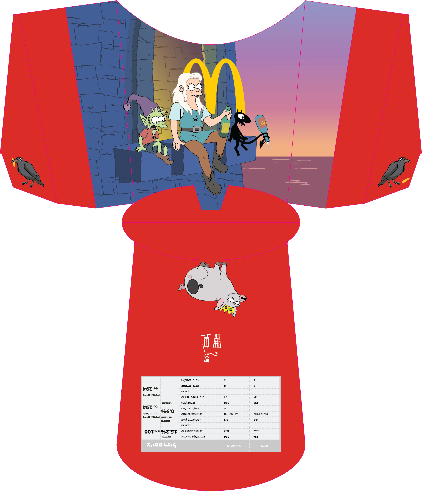

# 🍟 Fries Packaging Project - Disenchantment

### Project Description
This is a project where I designed a fries package inspired by the **Disenchantment** series.  
It was created as part of the final project for my Illustrator course, showcasing advanced graphic design techniques and creativity.

---

## 🖌️ Work Process
1. **Concept Development**:
   - Researching the art style and graphic elements of the Disenchantment series.
   - Developing a unique idea that blends the world of Disenchantment with a fries packaging design.

2. **Execution in Illustrator**:
   - Designing the central illustration and graphic elements.
   - Adapting the design to fit a fries package format.

---

## 🖼️ Preview
  

---

## 📺 About Disenchantment
Disenchantment is a comedy series created by Matt Groening, the mind behind "The Simpsons."  
The show is set in a medieval fantasy world filled with adventures, featuring characters like Bean, Luci, and Elfo.

---

## 🛠️ Tools and Technologies
- **Adobe Illustrator**: Used for creating the illustration and design.

---

## ⚖️ Copyright and Disclaimer
- The characters and elements featured in this project are the intellectual property of **Matt Groening** and the **Disenchantment** series.  
- Any logos, symbols, or branding related to **McDonald's** are the exclusive property of McDonald's Corporation.  
- This project was created for **educational purposes only** and is not intended for commercial use.  
- All rights to the original works remain with their respective copyright holders.

---

## 📢 Feedback and Suggestions
If you have ideas for improvement or questions about the process, feel free to open an issue or reach out to me!
